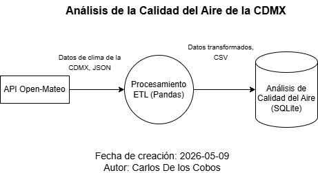

# Weather Data Pipeline - Ciudad de México

Pipeline ETL modular desarrollado en Python para extraer información climática desde la API de Open-Meteo, transformar los datos utilizando Pandas, almacenarlos en SQLite y ejecutar consultas analíticas mediante SQL.

---

# Características

- Extracción de datos desde una API REST
- Manejo de errores HTTP y validación de respuestas
- Transformación y limpieza de datos con Pandas
- Exportación a CSV
- Carga de datos a SQLite
- Consultas analíticas SQL
- Logging modular por etapa del pipeline
- Configuración mediante variables de entorno
- Arquitectura modular ETL

---

# Arquitectura del Pipeline



---

# Estructura del Proyecto

```text
EvaluacionTecnicaDataEngineer/
│
├── data/
│   ├── raw/
│   ├── processed/
│   ├── final/
│   ├── database/
│   └── logs/
│
├── sql/
│   └── weather_queries.sql
│
├── src/
│   ├── ingestion/
│   │   └── weather_ingestion.py
│   │
│   ├── transformation/
│   │   └── weather_transformation.py
│   │
│   ├── load/
│   │   └── weather_loader.py
│   │
│   ├── utils/
│   │   ├── config.py
│   │   └── logger.py
│   │
│   └── main.py
│
├── .env.example
├── .gitignore
├── requirements.txt
└── README.md
└── DOCS.md
```

---

# Tecnologías Utilizadas

- Python
- Pandas
- SQLite
- Requests
- dotenv

---

# Configuración del Poyecto

# 1. Clonar el Repositorio

```bash
git clone https://github.com/CarlosDlcg/EvaluacionTecnicaDataEngineer.git
```

# 2. Crear Entorno Virtual

## Windows
```bash
python -m venv venv
venv\Scripts\activate
```

## Linux / macOS
```bash
python3 -m venv venv
source venv/bin/activate
```

# 3. Instalar Dependencias

```bash
pip install -r requirements.txt
```

# 4. Crear Archivo .env

Crear un archivo llamado .env en la raíz del proyecto utilizando como referencia .env.example.

## Ejemplo
```env
LATITUDE=19.4326
LONGITUDE=-99.1332
TIMEZONE=auto

BASE_URL=https://api.open-meteo.com/v1/forecast
HOURLY_FIELDS=temperature_2m,precipitation

DB_PATH=data/database/weather_cdmx.db
LOG_DIR = "data/logs"
```

---

# Ejecución del Pipeline

Desde la raíz del proyecto ejecutar:
```bash
python -m src.main
```

El Pipeline realizará:
1. Extracción de datos climáticos desde Open-Meteo.
2. Almacenamiento de datos raw y processed.
3. Transformación y limpieza de datos.
4. Exportación del CSV final.
5. Carga de datos a SQLite.

---

# Ejecución de Consultas SQL

Las consultas analíticas se encuentran en: sql/weather_queries.sql

Para ejecutarlas se puede utilizar cualquier cliente compatible con SQLite, por ejemplo:
- SQLite Extension para Visual Studio Code
- DB Browser for SQLite
- SQLite CLI

La base de datos generada se encuentra en: data/database/weather_cdmx.db

---

# Logging

El proyecto implementa logging modular por etapa del pipeline:
```text
data/logs/
│
├── ingestion.log
├── transformation.log
├── loader.log
└── pipeline.log
```

---

# Autor

Carlos De los Cobos